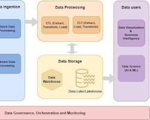

# SQL-Data-Cleaning-Layoffs

A comprehensive data cleaning pipeline designed to transform raw, inconsistent layoff data into a structured, analysis-ready format using Python and SQL.

## 🗺️ Project Architecture
The project follows a modular ETL (Extract, Transform, Load) pattern:



1. **Extract**: Raw CSV data is ingested via Python.
2. **Transform**: In-memory cleaning (Python) and advanced SQL queries (data standardization).
3. **Load**: Data is persisted in a structured SQLite database.

## 🚀 Getting Started

### Prerequisites
* Python 3.x
* `pandas` and `sqlite3`

### Installation
1. Clone the repository:
   ```bash
   git clone [https://github.com/skepsis21/SQL-Data-Cleaning-Layoffs.git](https://github.com/skepsis21/SQL-Data-Cleaning-Layoffs.git)

    Install dependencies:
    Bash

    pip install -r requirements.txt

Execution Workflow

    Ingest Data:
    Bash

    python setup_db.py

    Clean Data:
    Execute the queries found in Scripts/data_cleaning.sql within your SQL environment to standardize industries, remove duplicates, and handle nulls.

    Verify Results:
    Bash

    python Scripts/verify_data.py